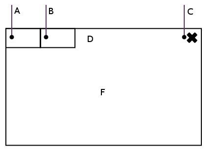

.. _intro:

Introduction
############

Hildon is a user interface toolkit based in GTK that targets mobile devices. Hildon was originally developed by Nokia for the Maemo operating system that powered its Tnternet Tablet devices.

Since version 5.0 (also known as Fremantle), Hildon widgets are specially designed to be finger-friendly, that is, easily used on touch-screen devices. Hildon is published under the LGPL license which gives you the right to develop free and open source, as well as commercial, software with Hildon without being charged for licenses or royalties.

Since it is based on GTK, Hildon offers an object-oriented API, although written in C.

GTK is a library for creating user interfaces that is used in a number of important projects like GNOME. There will be presented a lot of GTK and Glib references in this document. Glib is a library that offers functions to manage memory and data structures, as well as some replacements for standard calls in order to increase portability. Although they may be explained, for a more detailed explanation about GTK and Glib, readers should check the GTK's and Glib's own documentation.

This book is intended for developers and covers the usage of Hildon to create graphical user interfaces. From a simple "Hello World" program to more complex examples, a number of widgets will be presented and their usage to accomplish some tasks will be explained from a technical point of view. After reading and understanding the contents of this document, you will be able to understand the process of graphical user interfaces programming and build effective touch interfaces for mobile devices with Hildon.

This document is not a Python tutorial, it assumes that readers already have a good knowledge of the Python programming language. Previous experience on creating graphical user interfaces with GTK would surely be helpful but is not mandatory. This book targets the development of graphical user interfaces, not the design of such. For guidelines about designing interfaces thinking in usability and user experience, please consult the Hildon Human Interface Guidelines.

.. _desktop-overview:

Desktop Overview
****************

This section gives a brief overview of the Hildon desktop area so you have a better understand of what are the applications' domains and layout.

:ref:`desktop-overview-general-figure` illustrates the look of the desktop when an application's normal window is shown. As for the figure's legend, the following list explains it:

* *A:* Task switcher button. Tapping on it, the application is put in second plan and the desktop is quickly shown allowing you to choose any running application, as well as the application you had on before. From this new view you can access the home view by pressing the dimmed area around the applications' thumbnails, or launch another task by tapping the task switcher button that bocomes, in this view, a task launcher button.
* *B:* Status area button. Provides information about the status of the device or applications. A status view can be accessed by pressing the status area.
* *C:* Close button. Closes the application. Note that if the current application's window is a subview (see :ref:`ch-Windows` for detailed information), instead of a close button, there will be a back button. The back button also closes the window but instead of closing the application, it goes back to a previous view.
* *D:* Title area. Shows an identifier of the application's current task, usually its name but may also be a document's name, etc. Tapping on it will call the application's menu.
* *F:* Application area. Shows the actual application's contents.

.. _desktop-overview-general-figure:

  Three radio buttons

Note that the above explanation refers to the normal view of an application. When using an application on fullscreen mode, only the application area is shown. It should be also relevant to refer that if an application has a toolbar widget, it will be shown at the very bottom of the application's area, both in normal and in fullscreen views.

